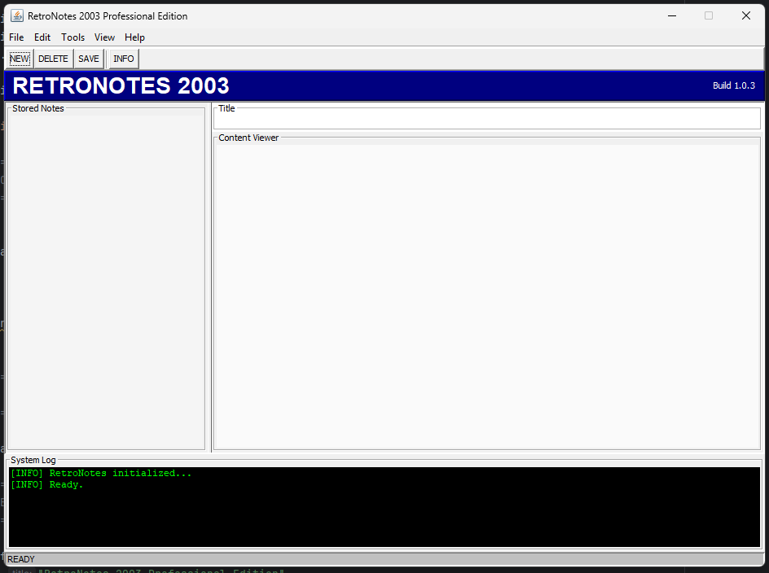

# RetroNotes 2003


A retro-style desktop note manager inspired by early 2000s Windows utility software.

Built in Java using Swing with a classic Windows XP / old desktop utility aesthetic.

---

## Features

- Create notes  
- Edit existing notes  
- Delete notes  
- Real-time note viewer  
- Retro Windows-style UI  
- System log panel  
- Toolbar buttons  
- Status bar updates  
- Classic utility software aesthetic  

---

## UI Style

RetroNotes 2003 is intentionally designed to resemble:

- Windows XP utilities  
- Early 2000s productivity software  
- Classic Java Swing applications  
- Old desktop organizer tools  
- Retro system utilities  

The project deliberately avoids modern flat UI design in favor of a nostalgic desktop feel.

---

## Technologies Used

- Java 21  
- Java Swing  
- Object-Oriented Programming (OOP)  
- Event-driven GUI architecture  

---

## Project Structure


src/
├── Main.java
└── note/
├── Note.java
└── NoteManager.java


---

## Architecture


GUI Layer
↓
NoteManager
↓
ArrayList<Note>


The application cleanly separates:

- UI rendering  
- Note management logic  
- Data storage objects  

---

## Screenshot (UI Mockup)


+---------------------------------------------------+
| RETRONOTES 2003 |
+---------------------------------------------------+
| [NEW] [DELETE] [SAVE] [INFO] |
+-------------------+-------------------------------+
| Stored Notes | Content Viewer |
| | |
| Homework | Finish Java GUI project |
| Ideas | |
| | |
+-------------------+-------------------------------+
| System Log |
| [INFO] RetroNotes initialized... |
+---------------------------------------------------+
| READY |
+---------------------------------------------------+


---

## Current Features

- Dynamic note creation  
- Title/content synchronization  
- Note selection system  
- Editable note storage  
- Retro toolbar system  
- Logging console  

---

## Planned Features

- File saving/loading  
- SQLite support  
- Export to `.txt`  
- Search system  
- Multiple themes  
- Startup splash screen  
- Keyboard shortcuts  

---

## Running the Project

Clone the repository:

```bash
git clone https://github.com/yourusername/RetroNotes2003.git
```
Open the project in IntelliJ IDEA (or any Java IDE).

Run:

Main.java
Why This Project Exists

RetroNotes 2003 was created as a learning project focused on:

Java GUI programming
Swing layouts
Event-driven systems
Object-oriented architecture
Desktop application design

while also recreating the feel of early 2000s desktop software.

License

MIT License

Author

Made with questionable UI decisions and excessive nostalgia.
